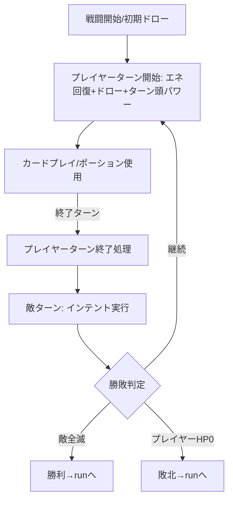

# combat 概要

## 目的・背景

ターン制カードバトルを担う、本プロジェクトの中核機能エリア。
プレイヤー（アイアンクラッド）と敵が交互に行動し、カードのプレイ・ブロック・状態異常（パワー）・敵の意図（インテント）などが絡み合う戦闘を実装する。

本プロジェクトの最優先要件である **「操作性・システム・エフェクトの完全再現」** が最も強く求められる領域。原作と同じ libGDX を用い、原作の **アクションキュー（GameActionManager）** による逐次処理モデルを踏襲することで、ダメージ計算・状態変化・演出の**順序とタイミング**を忠実に再現する。

## スコープ

### 作るもの

- **アクションキュー**：戦闘中の全処理（ダメージ/ブロック/ドロー/パワー付与等）を逐次実行する原作準拠の行動キュー。割り込み・予約・同時解決の順序を再現
- **ターン進行**：戦闘開始 → プレイヤーターン（ドロー/エネルギー回復/カードプレイ）→ ターン終了 → 敵ターン（インテント実行）→ ループ、の構造
- **カードシステム**：手札・山札・捨て札・消滅札の管理、カードのプレイ、コスト、ターゲット、アップグレード（戦闘内）
- **エネルギー**：毎ターンの回復、消費、X コスト
- **パワー（状態異常）**：バフ/デバフの付与・スタック・減衰・発動タイミング（筋力/弱体/脆弱/中毒/金属化など）
- **ダメージ/ブロック計算**：攻撃力修正（筋力・弱体）、被ダメ修正（脆弱）、ブロックによる軽減、HP/ブロックの更新順序
- **敵 AI / インテント**：敵の行動選択（原作の確率・連続回避ルール）と次行動の予告表示
- **ターゲティング/入力**：カードのドラッグ＆ドロップ、対象選択、ホバー、終了ターンなどの操作感
- **エフェクト/アニメーション**：被弾・ブロック・カード移動・パーティクル・ダメージ数値・画面シェイク等の演出
- **勝敗判定**：全敵撃破で勝利、プレイヤー HP 0 で敗北を `run` へ返す

### 作らないもの

- 戦闘報酬の付与（`run` の報酬フロー）
- ラン全体の永続状態管理（`run` の RunState。combat は戦闘開始時に受け取り、終了時に結果を返す）
- 全カード/全敵/全パワーの網羅（`content` で再現対象を絞る。combat はそれらを駆動する**仕組み**を完全再現）

## 制約

- 原作のアクションキュー方式を踏襲し、処理順・タイミングを再現すること（システム完全再現の根幹）。
- 戦闘ロジックはレンダリングから分離し、ヘッドレスでユニットテスト可能にする（決定的乱数を使用）。
- combat は `RunState`（プレイヤー HP/デッキ/レリック/ポーション）を入力に取り、`CombatResult`（勝敗・消費ポーション・HP 変化等）を出力する境界を守る。
- 入力・演出の体感は Windows 実機で最終確認する（開発環境では再生・検証ロジックまで）。

## 完了条件

- 戦闘を開始するとデッキから手札が引かれ、エネルギーが回復し、カードをドラッグしてプレイできる
- カード効果・パワー・ダメージ/ブロックがアクションキュー経由で原作と同じ順序・タイミングで解決する
- 敵がインテントを予告し、ターン終了後にその行動を実行する
- 全敵撃破で勝利、プレイヤー HP 0 で敗北を `run` に返す
- 主要なダメージ/ブロック/パワー解決がヘッドレスでユニットテストできる
- 操作（ドラッグ/対象選択/ターン終了）とエフェクトが原作の体感に一致する（実機確認）

## 画面イメージ

戦闘画面レイアウト：

```
+-----------------------------------------------------------+
|  [敵1: 意図⚔12]      [敵2: 意図🛡]                         |  ← 敵＋インテント
|                                                           |
|                                                           |
|   [プレイヤー]                                            |
|   HP 68/80  ブロック 5                                    |
|                                                           |
|  山札:7                                       捨て札:3    |
|  [エネルギー ●3/3]                       [ ターン終了 ]   |
|        \   [カード][カード][カード][カード]   /            |  ← 弧状の手札
+-----------------------------------------------------------+
```

ターン進行：


