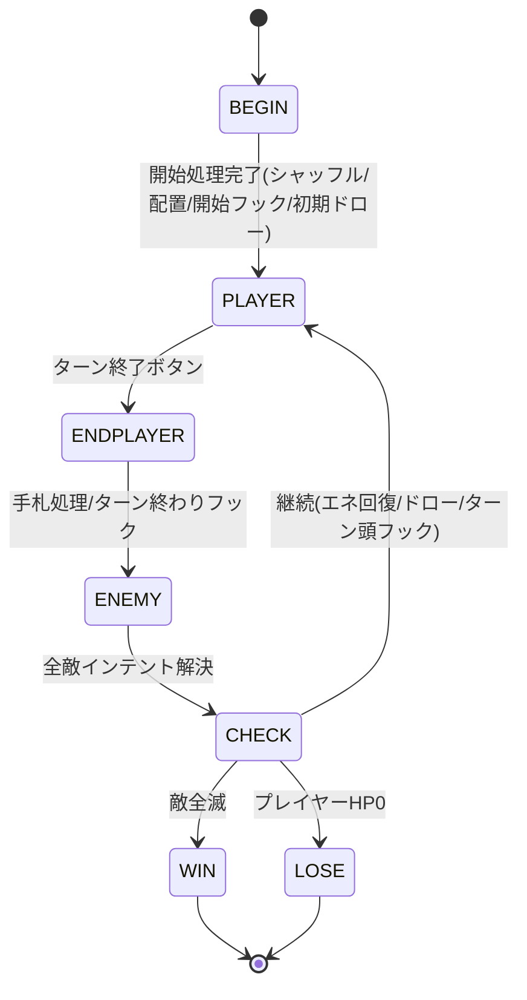

# turn-flow 概要

## 目的・背景

戦闘のターン構造（フェーズ進行）と、それに付随するエネルギー回復・ドロー・ターン頭/終わりの定常処理を担う。action-queue（解決機構）の上に乗り、「いつ・何を・どの順で」キューへ積むかを統括する戦闘の進行管理者。

原作の戦闘は「戦闘開始 → プレイヤーターン（エネ回復＋ドロー）→ カードプレイ → ターン終了（手札処理）→ 敵ターン（インテント実行）→ …」という固定構造を持ち、各境界でパワー/レリックのフックが発火する。本サブ項目はこの構造とフック発火順を再現する。

## スコープ

### 作るもの

- **フェーズ状態機械**：BEGIN → PLAYER → END(player) → ENEMY → （ループ）→ 勝敗
- **戦闘開始処理**：デッキ→山札シャッフル、敵配置、開始時パワー/レリックフック、初期ドロー
- **プレイヤーターン開始**：エネルギー回復、規定枚数ドロー、ターン頭パワー（筋力付与系/再生等）の処理
- **ターン終了処理**：手札の保持/破棄（原作は基本破棄、保持系効果は例外）、ターン終わりパワー、ブロックの持ち越し規則
- **敵ターン**：各敵のインテント実行をキューへ（enemy サブ項目の takeTurn を順に）、敵のターン頭/終わりパワー
- **エネルギー管理**：最大エネルギー、毎ターン全回復、消費 API、X コスト解決
- **フック発火点の定義**：onBattleStart / atTurnStart / onPlayerTurnStart / atTurnEnd / onEnemyTurnStart など、パワー・レリックが購読する境界

### 作らないもの

- 個々のカード/敵/パワーの効果（cards/enemy/powers が実装）
- アクションの解決機構そのもの（action-queue）
- 入力受付の UI（input）

## 制約

- 全ての定常処理は action-queue のアクションとして積み、演出と状態変化の順序を一致させる（即時計算しない）。
- フェーズ遷移はキューがアイドルになってから進める（演出途中で遷移しない）。
- ヘッドレスで「1 ターンの進行」を決定的に検証できること。

## 完了条件

- 戦闘開始でシャッフル・初期ドロー・開始フックが正しい順で実行される
- プレイヤーターン開始でエネルギー全回復と規定ドローが行われる
- ターン終了で手札処理とターン終わりフックが実行され、敵ターンへ移る
- 敵ターンで各敵のインテントが順に解決し、勝敗判定後に次プレイヤーターンへ戻る
- 上記の順序がヘッドレステストで再現できる

## 画面イメージ

フェーズ遷移（action-queue がアイドルになるたびに進む）：

