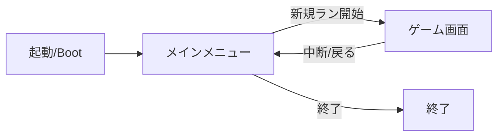

# foundation 概要

## 目的・背景

ポーティング全体の土台となるアプリケーション基盤を構築する。
libGDX アプリケーションの起動からシーン（画面）管理、入力処理の共通基盤、アセット読み込み、メインメニューまでを提供し、以降の機能エリア（戦闘・マップ・ラン進行など）が乗る器を用意する。

原作 STS と同じ libGDX を採用するため、原作のフレーム駆動・描画・入力モデルを踏襲し、後続機能で「操作性・エフェクトの完全再現」を実現できる前提を整えることが狙い。

## スコープ

### 作るもの

- libGDX アプリケーションのエントリポイントとデスクトップ起動（LWJGL3）
- シーン（Screen）管理：メインメニュー ⇄ ゲーム本編の切り替え、画面スタック
- 共通入力基盤：マウス／キーボードのハンドリング、入力アクションの抽象化
- アセット管理：`AssetManager` によるテクスチャ・フォント・音声の一元ロードと解放
- 共通描画基盤：`SpriteBatch` / カメラ / 仮想解像度（Viewport）による解像度非依存レイアウト
- フレームループ基盤：固定タイムステップに依らない `delta` 駆動の更新と描画分離
- メインメニュー画面：「新規ラン開始」「（任意）設定」「終了」
- Windows 向け配布の足場：Gradle ビルド構成と jpackage による .exe 生成手順

### 作らないもの

- 戦闘ロジック、カード、敵、マップ進行（各機能エリアで実装）
- ラン状態のセーブ／ロード（`run` 機能エリアで扱う）
- 設定項目の中身（音量・解像度など。器のみ用意し、項目は任意で後続）
- アイアンクラッド以外のキャラクター選択

## 制約

- 開発環境は Linux（WSL2 / devcontainer）。GUI 表示を伴う動作確認は Windows 側で行う必要がある。ヘッドレスでビルド・ユニットテストまでを担保する。
- 現状 JDK / Gradle が未導入。導入が前提タスク（dev-notes に要望として記録）。
- 原作アセットは同梱しない。プレースホルダアセットで基盤を検証する。
- 仮想解像度は原作準拠の 1920×1080 を基準とし、ウィンドウリサイズ時はレターボックスでアスペクト比を維持する。

## 完了条件

- `gradlew run`（Windows）でウィンドウが起動し、メインメニューが表示される
- メインメニューから「新規ラン開始」でゲーム画面（プレースホルダで可）へ遷移できる
- ウィンドウのリサイズで UI のアスペクト比が崩れない
- `gradlew test` がヘッドレスで通る（Linux 開発環境で実行可能）
- `jpackage` 手順で Windows .exe が生成できることを手順として文書化

## 画面イメージ

```
+-------------------------------------------+
|                                           |
|            SLAY THE SPIRE (再現)          |
|                                           |
|            [ 新規ラン開始 ]               |
|            [ 設定（任意）  ]              |
|            [ 終了         ]               |
|                                           |
+-------------------------------------------+
```

遷移：


