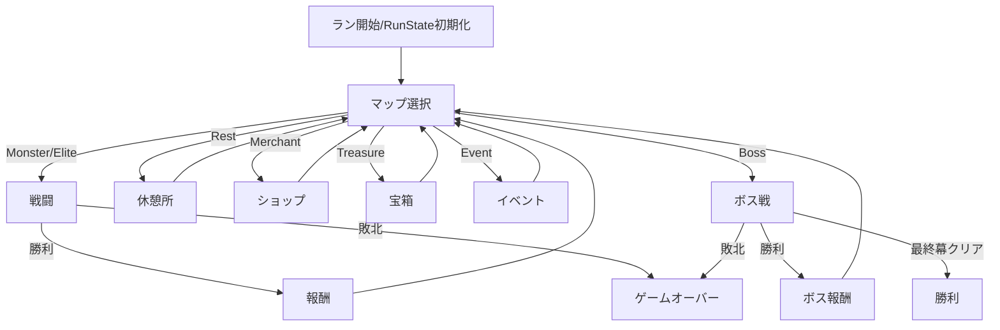

# run 概要

## 目的・背景

1 回のプレイ（ラン）全体を束ねる進行管理を担う機能エリア。
プレイヤーの永続状態（HP・デッキ・レリック・ポーション・所持金・現在フロア）を保持し、マップ上のノードを 1 つずつ解決しながら、戦闘・休憩・ショップ・宝箱・イベント・ボスへとルーティングする。戦闘や各ノードはそれぞれの機能エリアが実装し、`run` はそれらを呼び出して結果を受け取り、状態を更新する「司令塔」となる。

原作の「フロアを進むごとに状態が積み上がっていくローグライク構造」を再現することが狙い。

## スコープ

### 作るもの

- **RunState**：1 ランで持ち越す永続状態（現在/最大 HP、所持金、マスターデッキ、レリック、ポーション、現在のフロア/幕、マップ位置、RNG シード群）
- **RunController**：ノード解決ループ。マップ選択 → ノード種別に応じた画面起動 → 結果反映 → 次へ、を回す
- **報酬フロー**：戦闘勝利後のカード報酬／所持金／（エリート・ボス・宝箱の）レリック／ポーション獲得画面
- **非戦闘ノードの司令**：休憩所・ショップ・宝箱・イベントの起動と結果反映（各画面の中身は対応するサブ項目で実装）
- **ゲームオーバー / 勝利**：HP 0 で敗北、最終ボス撃破で勝利の判定と画面遷移
- **RNG 管理**：シードに基づく決定的乱数（マップ生成・カード報酬・敵選択等で系統を分離）

### 作らないもの

- 戦闘そのものの処理（`combat` 機能エリア）
- マップ生成・描画（`map` 機能エリア）
- カード/レリック/ポーション/敵/イベントの個別データ定義（`content` 機能エリア）
- セーブの「中断して後で再開」UI（中断データの保存形式は設計に含むが、再開 UI は任意・後続）
- アセンション・デイリー（プロジェクト全体スコープ外）

## 制約

- foundation の `ScreenManager` / `GameContext` に依存する（その上で動作）。
- 報酬・ショップ・休憩・宝箱・イベントは独立した UI 画面を持つため、分割ルールに従いサブ項目へ分割する。`run` 親はそれらの起動と RunState 更新という横断的責務のみを持つ。
- 原作の確率・選出ロジックを再現するため、RNG はシード固定で決定的に動くこと（テスト可能性も担保）。

## 完了条件

- 新規ランを開始すると RunState が初期化され（アイアンクラッド初期デッキ・初期レリック・初期 HP）、マップ画面へ入る
- マップでノードを選ぶと種別に応じた画面が起動し、終了後に RunState が正しく更新されて次のノード選択へ戻る
- 戦闘勝利後に報酬画面が出て、選択結果（カード/金/ポーション/レリック）が RunState に反映される
- HP 0 で敗北画面、最終ボス撃破で勝利画面に遷移する
- RunState の更新ロジックがヘッドレスでユニットテストできる

## 画面イメージ

ラン進行の状態遷移：



常時表示する HUD（トップバー）イメージ：

```
+-------------------------------------------------------------+
| HP 72/80   $135   [レリック...]      フロア 6      [ポーション] |
+-------------------------------------------------------------+
```
